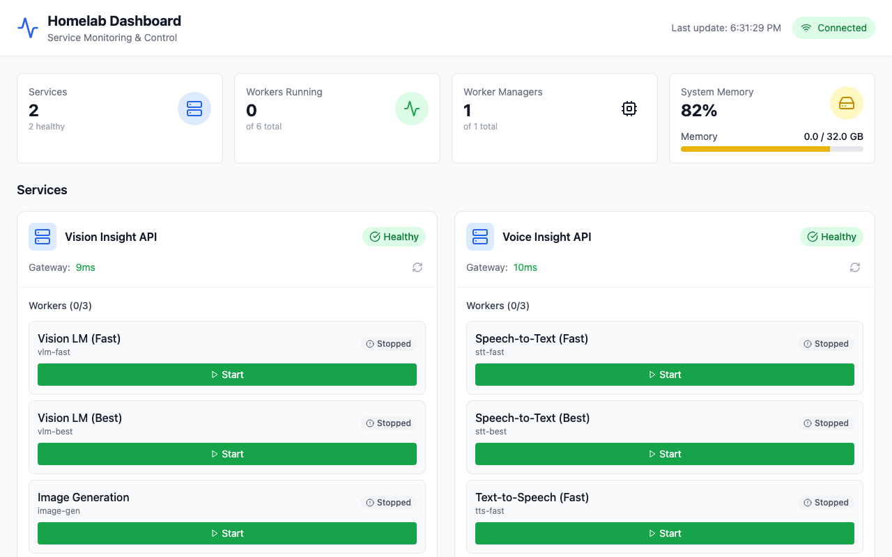

# Homelab Dashboard



모든 vibe-homelab 서비스의 상태를 모니터링하고 관리하는 대시보드입니다.

> Part of Vibe Homelab: https://vibe-homelab.github.io

## Features

- **서비스 모니터링**: Vision Insight, Voice Insight 등 서비스 상태 실시간 확인
- **워커 제어**: 워커 시작/중지/강제종료
- **메모리 모니터링**: 시스템 메모리 사용량 확인
- **실시간 업데이트**: WebSocket 기반 실시간 상태 반영

## Ports

| 구성요소 | 기본 포트 |
|---|---:|
| Frontend (Docker) | `4000` |
| Frontend (Dev) | `3000` |
| Backend API | `4010` |

## Quick Start

### Docker (권장)

```bash
# 빌드 및 실행
make build
make start

# 브라우저에서 http://localhost:4000 접속
```

### Full Stack (Dashboard + Gateways)

대시보드 + Vision/Voice Gateway를 한 번에 실행하려면 `vibe-homelab.github.io`의 스택 compose를 사용하세요:

- Stack guide: `vibe-homelab.github.io/stack/README.md`
- Compose: `vibe-homelab.github.io/stack/docker-compose.yml`

### Development

```bash
# 의존성 설치
make install

# Backend 실행 (터미널 1)
make dev-backend

# Frontend 실행 (터미널 2)
make dev-frontend

# 브라우저에서 http://localhost:3000 접속
```

## Configuration

`backend/config.yaml`에서 모니터링할 서비스를 설정합니다:

```yaml
services:
  vision-insight:
    name: "Vision Insight API"
    gateway:
      host: "host.docker.internal"
      port: 8000
    # Optional: if the service gateway enforces auth, set the same key here.
    # api_key: ""
    worker_manager:
      host: "host.docker.internal"
      port: 8100
    workers:
      - alias: "vlm-fast"
        name: "Vision LM (Fast)"
        type: "vlm"

  voice-insight:
    name: "Voice Insight API"
    gateway:
      host: "host.docker.internal"
      port: 8200
    # Optional: if the service gateway enforces auth, set the same key here.
    # api_key: ""
    worker_manager:
      host: "host.docker.internal"
      port: 8210
```

## Architecture

```
┌─────────────────────────────────────────────────────┐
│               Browser (:4000 Docker)                │
│               Browser (:3000 Dev)                   │
└─────────────────────────┬───────────────────────────┘
                          │
          ┌───────────────▼───────────────┐
          │     Frontend (React)          │
          │     - Dashboard UI            │
          │     - WebSocket Client        │
          └───────────────┬───────────────┘
                          │
          ┌───────────────▼───────────────┐
          │     Backend (FastAPI) :4010   │
          │     - REST API                │
          │     - WebSocket Server        │
          │     - Health Checker          │
          └───────────────┬───────────────┘
                          │
    ┌─────────────────────┼─────────────────────┐
    │                     │                     │
    ▼                     ▼                     ▼
┌───────────┐      ┌───────────┐        ┌───────────┐
│  Vision   │      │   Voice   │        │  Future   │
│  Insight  │      │  Insight  │        │  Service  │
│  :8000    │      │  :8200    │        │           │
└───────────┘      └───────────┘        └───────────┘
```

## API Endpoints

| Endpoint | Method | Description |
|----------|--------|-------------|
| `/healthz` | GET | 대시보드 헬스체크 |
| `/api/v1/services` | GET | 서비스 목록 및 상태 |
| `/api/v1/services/{id}` | GET | 특정 서비스 상세 정보 |
| `/api/v1/services/{id}/workers/{alias}/spawn` | POST | 워커 시작 |
| `/api/v1/services/{id}/workers/{alias}/stop` | POST | 워커 중지 |
| `/api/v1/system/overview` | GET | 시스템 개요 |
| `/ws` | WebSocket | 실시간 업데이트 |

## Tech Stack

- **Backend**: Python 3.12, FastAPI, WebSocket
- **Frontend**: React 18, TypeScript, Vite, Tailwind CSS, Zustand
- **Container**: Docker, docker-compose

## Docker 이미지 (GHCR)

사전 빌드된 이미지는 GHCR로 배포됩니다.

```bash
docker pull ghcr.io/vibe-homelab/homelab-dashboard-backend:latest
docker pull ghcr.io/vibe-homelab/homelab-dashboard-frontend:latest
```

## Troubleshooting

| 증상 | 원인 | 해결 |
|---|---|---|
| UI에 서비스가 안 뜸/에러 | `backend/config.yaml` 미설정 또는 게이트웨이 접근 불가 | `curl http://localhost:4010/api/v1/services`로 백엔드 상태 확인 |
| Docker에서 `host.docker.internal`이 동작하지 않음(리눅스 등) | Docker/OS 차이 | `backend/config.yaml`의 `host`를 실제 호스트 IP로 변경 |

## License

MIT
